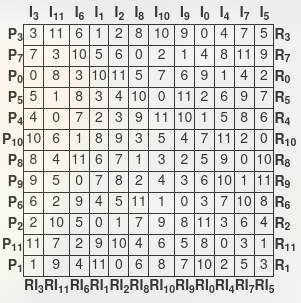

# 12-tone Matrix Generator

The 12-tone technique is a 20th century method of musical serial composition most associated
with Arnold Schoenberg and the Second Viennese School.
One of my favorite pieces composed in this technique is [Schoenberg's Chamber Symphony No. 1, Op. 9.](https://www.youtube.com/watch?v=UK9PxEN4LFU)
12-tone technique is based off of the _tone row_, which can be defined axiomatically as follows:
* A tone row orders all 12 notes of the chromatic scale.
* A tone row contains no repeated notes.
* The inversion, retrograde, and retrograde-inversion of a tone row each are
  themselves tone rows. 
  - Inversion: Each interval in the sequence of intervals used in then inversion of a tone row
    is the compliment mod 12 of the corresponding interval in the tone row; i.e.
    the inversion flips the tone row's melodic contour upside-down. 
  - Retrograde: The retrograde of a tone row uses the reverse of the sequence of
    intervals used by the tone row.
  - Regrograde-inversion: The retrograde-inversion of a tone row is found by
    taking the retrograde followed by the inversion of a tone row.
* The transposition of any tone row is itself a tone row.
  - P<sub>k</sub> denotes the base tone row transposed up k half steps, where P<sub>0</sub>
    is the base tone row.
  - I<sub>k</sub>, R<sub>k</sub>, and RI<sub>k</sub> similarly denote the
    inversion, retrograde, and retrograde-inversions, respectively transposed up k half steps, 
    where I<sub>0</sub>, R<sub>0</sub>, and RI<sub>0</sub> are the inversion,
    retrograde, and retrograde-inversion of the base tone row, repectively.

Any melodic material included in a 12-tone composition must be a transformation
(transposition, inversion, retrograde, or retrograde inversion) of the base tone row.

For more reading, see the [Wikipedia article about the 12-tone technique](https://en.wikipedia.org/wiki/Twelve-tone_technique).

Also, checkout this great video by Nahre Sol that displays 
the compositional process using this technique: [https://en.wikipedia.org/wiki/Twelve-tone_technique](https://en.wikipedia.org/wiki/Twelve-tone_technique).

The reletionship between all of these tone row transformations
can be summarized in a 12-tone matrix.
Here is an example: 

.

Matrices of this form define _all_ available tone rows, given a base tone row.
This project serves as a 12-tone matrix calculator.

## Installation

``` sh
$ git clone git@github.com:mmuldo/12-tone.git
$ cd 12-tone
```

## Usage

``` sh
$ make driver
$ ./driver
Enter a 12-tone sequence where
	0 => C
	1 => C#/Db
	2 => D
	3 => D#/Eb
	4 => E
	5 => F
	6 => F#/Gb
	7 => G
	8 => G#/Ab
	9 => A
	10 => A#/Bb
	11 => B
Note 0:0
Note 1:5
Note 2:1
Note 3:8
Note 4:9
Note 5:3
Note 6:10
Note 7:4
Note 8:6
Note 9:7
Note 10:2
Note 11:11

Matrix:
P 0: C  F  Db Ab A  Eb Bb E  Gb G  D  B
P 7: G  C  Ab Eb E  Bb F  B  Db D  A  Gb
P11: B  E  C  G  Ab D  A  Eb F  Gb Db Bb
P 4: E  A  F  C  Db G  D  Ab Bb B  Gb Eb
P 3: Eb Ab E  B  C  Gb Db G  A  Bb F  D
P 9: A  D  Bb F  Gb C  G  Db Eb E  B  Ab
P 2: D  G  Eb Bb B  F  C  Gb Ab A  E  Db
P 8: Ab Db A  E  F  B  Gb C  D  Eb Bb G
P 6: Gb B  G  D  Eb A  E  Bb C  Db Ab F
P 5: F  Bb Gb Db D  Ab Eb A  B  C  G  E
P10: Bb Eb B  Gb G  Db Ab D  E  F  C  A
P 1: Db Gb D  A  Bb E  B  F  G  Ab Eb C

```

